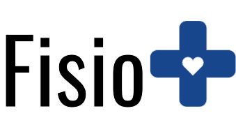

# Fisio+

  

## Integrantes

* Bruna Ribeiro Pérez | 1426468@sga.pucminas.br
* Guilherme Henrique Coelho Santos | 1395175@sga.pucminas.br
* José Victor Mendes Dias | 1433596@sga.pucminas.br
* Rubens Marcelo Ramos dos Santos | 1391000@sga.pucminas.br

## Professor

* Danilo Boechat Seufitelli
* Hugo Bastos de Paula
* Luiz Henrique da Costa Silva

## Instruções de utilização

Assim que a primeira versão do sistema estiver disponível, deverá complementar com as instruções de utilização. Descreva como instalar eventuais dependências e como executar a aplicação.

## Histórico de versões

* 0.1.1
    * CHANGE: Atualização das documentações. Código permaneceu inalterado.
* 0.1.0
    * Implementação da funcionalidade X pertencente ao processo P.
* 0.0.1
    * Trabalhando na modelagem do processo de negócio.

# Links
- [API docs - Prod](https://fisiomais-backend.azurewebsites.net/swagger-ui/index.html#/)
- [Frontend - Prod](https://fisiomais.vercel.app/)

