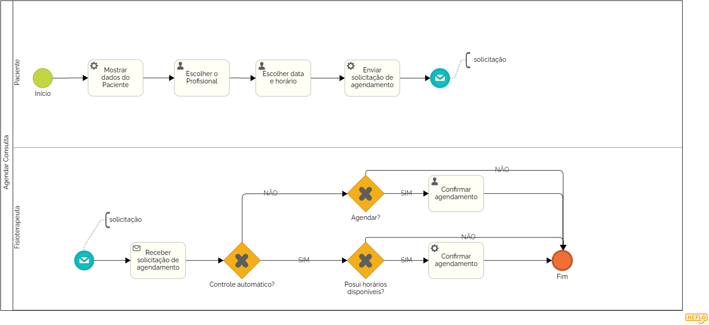

### **3.3.1 Processo 1 – Solicitar Agendamento de Consulta**

---

Este processo descreve a solicitação do agendamento de consultas de fisioterapia de forma online. O agendamento pode ser realizado apenas pelo paciente.

O processo começa quando o paciente acessa o sistema de agendamento. O usuário deve fornecer informações relevantes, como o fisioterapeuta desejado para realizar a marcação, a data e a hora desejadas para a consulta (de acordo com as limitações de agenda do fisioterapeuta).

Depois de preencher esses dados, o paciente envia a solicitação de agendamento que ficará pendente até que o outro envolvido faça uma confirmação (caso o controle automático esteja desativado) ou imediatamente confirmada, caso contrário.

Este processo permite que os pacientes agendem suas consultas sem a necessidade de ligar, visitar a clínica ou contatar por e-mail.

Em seguida, apresentamos o modelo do processo 1, descrito no padrão BPMN.

### **Detalhamento das atividades**

Nessa seção serão apresentadas descrições detalhadas de cada atividade, orientando sua execução no contexto do processo.

---

**Atividade: Mostrar dados do Paciente**

Nesta etapa, o sistema apresenta os dados do paciente, que já foram preenchidos em algum outro momento. Como Nome, data de nascimento, gênero, CPF, endereço, telefone e email cadastrados.

| **Comandos**  | **Destino**                       | **Tipo** |
| ------------- | --------------------------------- | -------- |
| Próximo Passo | Preencher informações da consulta | default  |

---

 

**Atividade: **Atividade: Preencher informações da consulta**

Nesta etapa, o paciente escolhe a data e o horário da consulta e o profissional desejado.

| **Campo**           | **Tipo**      | **Restrições**                           | **Valor default** |
| ------------------- | ------------- | ---------------------------------------- | ----------------- |
| Profissional        | Seleção única | Opções: [Lista de profissionais]         | -                 |
| Data da Consulta    | Data          | De acordo com a agenda do Fisioterapeuta | -                 |
| Horário da Consulta | Hora          | De acordo com a agenda do Fisioterapeuta | -                 |

| **Comandos** | **Destino**                       | **Tipo** |
| ------------ | --------------------------------- | -------- |
| Próximo      | Enviar solicitação de agendamento | default  |

---

 

**Atividade: Mostrar resumo da consulta**

Nesta etapa, o sistema apresenta os dados resumidos da consulta e seu estado até o momento (Confirmado, Pendente...)

| **Comandos**         | **Destino**                             | **Tipo** |
| -------------------- | --------------------------------------- | -------- |
| Voltar para o início | Fim do processo (vai para tela inicial) | default  |