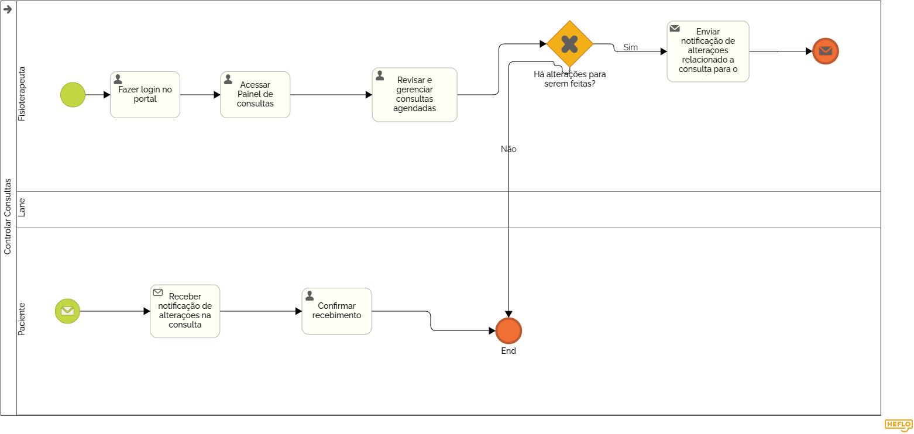

### 3.3.2 Processo 2 – Controlar Consultas Do Fisioterapeuta

Esse processo refere-se ao gerenciamento de consultas por parte do fisioterapeuta. O gerenciamento de consultas desempenha um papel crucial no sistema, pois assegura que o profissional possa ter um controle adequado sobre sua agenda e seus pacientes. O fisioterapeuta poderá visualizar as consultas que estão agendadas para ele, podendo alterar o status da consulta, podendo ser: “Aguardando”, “Em andamento” e “Finalizada”. O fisioterapeuta também poderá visualizar o histórico de consultas, podendo filtrar por data, status e paciente. Como oportunidade de melhorias futuras, o fisioterapeuta poderá visualizar o histórico de consultas de um paciente específico, podendo filtrar por data e status.

#### Detalhamento das atividades
---

#### **Atividade: Acessar Painel de Consultas**

**Objetivo:** Permitir que o fisioterapeuta visualize e gerencie suas consultas agendadas.

| **Campo**          | **Tipo**       | **Restrições** | **Valor default** |
| ------------------ | -------------- | --------------- | ----------------- |
| Lista de Consultas | Tabela         | -               | -                 |

| **Comandos**       | **Destino**                         | **Tipo** |
| ------------------ | ---------------------------------- | -------- |
| Visualizar Detalhes| Detalhes da Consulta Agendada       | link     |

---

#### **Atividade: Gerenciar Consultas Agendadas**

**Objetivo:** Permitir a revisão e gestão eficiente das consultas agendadas.

| **Campo**          | **Tipo**            | **Restrições** | **Valor default** |
| ------------------ | ------------------- | --------------- | ----------------- |
| Consultas Agendadas| Tabela              | -               | -                 |
| Status da Consulta | Seleção única       | Confirmada, Pendente, Cancelada | - |

| **Comandos**       | **Destino**                         | **Tipo** |
| ------------------ | ---------------------------------- | -------- |
| Alterar            | Tela de Alteração de Consulta       | link     |
| Cancelar           | Tela de Cancelamento de Consulta    | link     |

---

#### **Atividade: Cadastrar Datas e Horários**

**Objetivo:** Facilitar a disponibilidade do fisioterapeuta, permitindo registrar os dias e horários em que está disponível para consultas.

| **Campo**              | **Tipo**           | **Restrições**                     | **Valor default** |
| ---------------------- | ------------------- | ---------------------------------- | ----------------- |
| Dias Disponíveis       | Seleção múltipla    | Segunda a Domingo                  | -                 |
| Horário de Início      | Hora                | Horário válido (formato 24 horas)  | -                 |
| Horário de Término     | Hora                | Horário válido (formato 24 horas)  | -                 |

| **Comandos**           | **Destino**                     | **Tipo** |
| ---------------------- | ------------------------------  | -------- |
| Salvar                 | Confirmação de Cadastro         | submit   |
| Cancelar               | Retorno ao painel anterior      | link     |

---