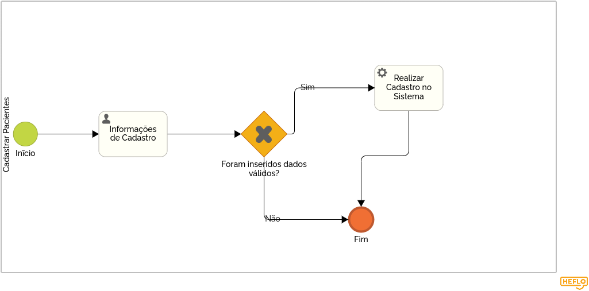

### 3.3.3 Processo 3 – Cadastrar Pacientes

O Cadastro de pacientes é um papel crucial desempenhado em sistemas de saúde e instituições  de fisioterapia. Esse papel envolve a coleta, armazenamento e manutenção de informações essenciais sobre os pacientes que recebem atendimento fisioterápico. Uma oportunidade de melhoria seria a automação do processo de cadastro de pacientes. Isso poderia ser feito através de um sistema de registro online, onde os próprios pacientes inserem suas informações. Isso economizaria tempo da equipe e reduziria erros de digitação.

A representação BPMN (Business Process Model and Notation) deste processo ainda será desenvolvida, conforme especificado no cronograma da matéria.

#### Detalhamento das atividades

---

**Atividade: Coleta de Dados Iniciais**

Os pacientes são responsáveis por fornecer informações pessoais, como nome, data de nascimento, endereço, número de telefone, e convênio.

| **Campo**         | **Tipo**         | **Restrições**             | **Valor default** |
| ---               | ---              | ---                        | ---               |
| Nome              | Caixa de Texto   | Apenas caracteres de letra |                   |
| Email             | Caixa de Texto   |                            |                   |
| Senha             | Caixa de Texto   |                            |                   |
| Endereço          | Área de texto    |                            |                   |
| Telefone de Contato| Área de texto   |                            |                   |
| Data de nascimento| Data             |                            |                   |
| CPF               | Caixa de Texto   |                            |                   |
| Gênero            | Seleção única    |                            |                   |

| **Comandos**         |  **Destino**                   | **Tipo**          |
| ---                  | ---                            | ---               |
| Cadastrar            | Tela de Login                  |                   |

