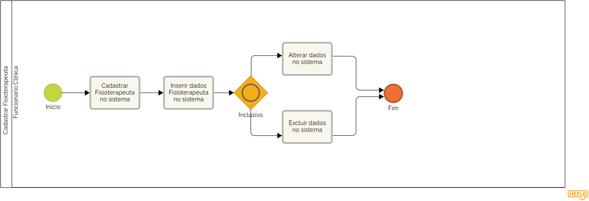

### 3.3.4 Processo 4 – Cadastrar  Fisioterapeuta

Este processo refere-se ao cadastro de  fisioterapeutas no sistema. Este cadastro é fundamental pois, ele se relaciona com o controle de consultas . Inicialmente, no cadastro de fisioterapeutas 
constará o nome do profissional, celular de contato e endereço (caso seja preciso localizar o profisional em uma situação de emergência)

 Processo BPMN  
                         

#### Detalhamento das atividades

**Nome da atividade: Inserir dados no Cadastro de Fisioterapeuta**

O cadastro de fisioterapeuta constará o nome do profissional, telefone de contato e endereço de contato(situação de emergência)

| **Campo**       | **Tipo**         | **Restrições** | **Valor default** |
| ---             | ---              | ---            | ---               |
| Nome            | Caixa de Texto   |                | Não possui        |
| Celular         | Número           |                |                   |
| Endereço        | Caixa de Texto   |                |                   |

| **Comandos**         |  **Destino**                   | **Tipo**          |
| ---                  | ---                            | ---               |
|  |                   |                                |                   |
|                      |                                |                   |
| Confirmar            |  Confirmação do Cadastro       | default           |
|  
|              |    |                   |

**Nome da atividade: Alterar dados no Cadastro de Fisioterapeuta**

Caso necessite editar algum campo no cadastro de fisioterapeuta bastará clicar no botão alterar.

| **Campo**       | **Tipo**         | **Restrições** | **Valor default** |
| ---             | ---              | ---            | ---               |
| Nome            | Caixa de Texto   |                | Não possui        |
| Celular         | Número           |                |                   |
| Endereço        | Caixa de Texto   |                |                   |

| **Comandos**         |  **Destino**                   | **Tipo**          |
| ---                  | ---                            | ---               |
|  |                   |                                |                   |
|                      |                                |                   |
|             |         |           |
| Alterar              |  Botão Alteração do Cadastro    |                   |
|             |  |                   |

**Nome da atividade: Excluir dados no Cadastro de Fisioterapeuta**

Caso necessite excluir  o cadastro de fisioterapeuta bastará clicar no botão excluir.

| **Campo**       | **Tipo**         | **Restrições** | **Valor default** |
| ---             | ---              | ---            | ---               |
| Nome            | Caixa de Texto   |                | Não possui        |
| Celular         | Número           |                |                   |
| Endereço        | Caixa de Texto   |                |                   |

| **Comandos**         |  **Destino**                   | **Tipo**          |
| ---                  | ---                            | ---               |
|  |                   |                                |                   |
|                      |                                |                   |
|             |         |           |
| Excluir              |  Botão Excluir dados do Cadastro    |                   |
|             |  |                   |