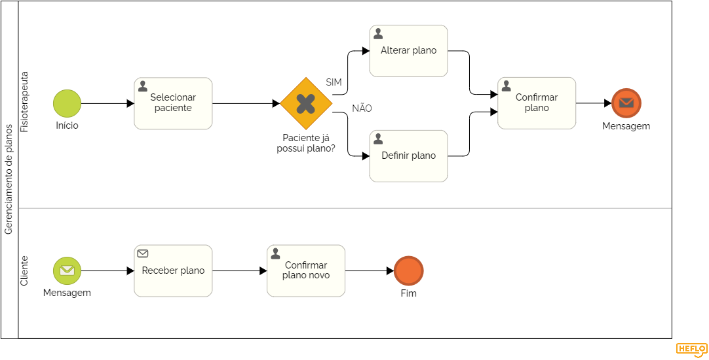

### 3.3.5 Processo 5 – Gerencir Plano de Tratamento

Este processo refere-se ao desenvolvimento e gerenciamento de um plano de tratamento individualizado para o paciente. O plano de tratamento é essencial para orientar e monitorar o progresso do paciente ao longo do tempo. O fisioterapeuta irá elaborar um plano após a consulta e poderá fazer ajustes conforme necessário, com base no feedback e evolução do paciente. O plano inclui exercícios, vídeos instrutivos e outros recursos educativos para ajudar o paciente. Futuramente, o sistema poderá oferecer monitoramento em tempo real do progresso do paciente, utilizando métricas e feedbacks automatizados.

#### Detalhamento das atividades
---

**Atividade: Criação do Plano de Tratamento**

Após a consulta, o fisioterapeuta inicia a elaboração do plano, selecionando exercícios e materiais relevantes para o paciente.

| **Campo**               | **Tipo**               | **Restrições**                             | **Valor default** |
| ---                     | ---                    | ---                                        | ---               |
| Lista de Exercícios     | Tabela                 | -                                          | -                 |
| Descrição               | Área de texto          | -                                          | -                 |
| Vídeos Instrutivos      | Links                  | URL válida                                 | -                 |

| **Comandos**            |  **Destino**                               | **Tipo** |
| ---                     | ---                                        | ---      |
| Salvar                  | Confirmação de Criação do Plano            | default  |
| Cancelar                | Retorno à Consulta                         | cancel   |

---

**Atividade: Monitoramento do Progresso do Paciente**

O fisioterapeuta pode visualizar os feedbacks do paciente e monitorar sua evolução ao longo do tempo.

| **Campo**               | **Tipo**               | **Restrições**                             | **Valor default** |
| ---                     | ---                    | ---                                        | ---               |
| Feedback do Paciente    | Área de texto          | -                                          | -                 |
| Data do Feedback        | Data                   | -                                          | -                 |
| Progresso               | Barra de progresso     | 0% a 100%                                  | 0%                |

| **Comandos**            |  **Destino**                               | **Tipo** |
| ---                     | ---                                        | ---      |
| Visualizar Detalhes     | Detalhamento do Feedback                   | default  |
| Retornar                | Retorno ao Plano de Tratamento             | cancel   |

---

**Atividade: Ajustes no Plano de Tratamento**

Baseado no feedback e progresso do paciente, o fisioterapeuta pode fazer alterações no plano.

| **Campo**               | **Tipo**               | **Restrições**                             | **Valor default** |
| ---                     | ---                    | ---                                        | ---               |
| Exercícios Atuais       | Tabela                 | -                                          | -                 |
| Novos Exercícios        | Seleção múltipla       | Lista de exercícios disponíveis            | -                 |
| Remover Exercícios      | Botões                 | -                                          | -                 |
| Comentários Adicionais  | Área de texto          | -                                          | -                 |

| **Comandos**            |  **Destino**                               | **Tipo** |
| ---                     | ---                                        | ---      |
| Atualizar               | Confirmação de Atualização do Plano        | default  |
| Cancelar Alterações     | Retorno ao Plano Original                  | cancel   |

---