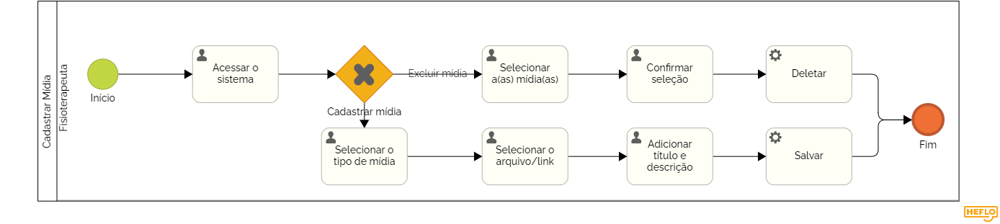

### 3.3.7 Processo 7 - Cadastrar Mídias

Este processo permite ao fisioterapeuta adicionar vídeos explicativos ou demonstrativos, assim como imagens ilustrativas ou instrucionais para auxiliar no tratamento. Estas mídias visam garantir que os pacientes compreendam e realizem os exercícios corretamente.

Em seguida, apresentamos o modelo do processo 1, descrito no padrão BPMN.

#### Detalhamento das atividades
---

**Atividade: Upload de Vídeo**

O fisioterapeuta pode fazer o upload de um vídeo do seu dispositivo ou inserir um link de um vídeo hospedado em uma plataforma externa.

| **Campo**               | **Tipo**           | **Restrições**                             | **Valor default** |
| ---                     | ---                | ---                                        | ---               |
| Arquivo de Vídeo        | Arquivo            | Formatos suportados: .mp4, .mov, .avi      | -                 |
| Link do Vídeo           | URL                | Deve ser um link válido                    | -                 |
| Título do Vídeo         | Caixa de texto     | Máximo de 100 caracteres                   | -                 |
| Descrição do Vídeo      | Área de texto      | Máximo de 500 caracteres                   | -                 |

| **Comandos**            |  **Destino**                               | **Tipo** |
| ---                     | ---                                        | ---      |
| Salvar                  | Confirmação de Upload                      | default  |
| Cancelar                | Retorno à Lista de Mídias                  | cancel   |

---

**Atividade: Upload de Imagem**

O fisioterapeuta pode fazer o upload de uma imagem do seu dispositivo para ilustrar ou orientar melhor os exercícios.

| **Campo**               | **Tipo**           | **Restrições**                             | **Valor default** |
| ---                     | ---                | ---                                        | ---               |
| Arquivo de Imagem       | Arquivo            | Formatos suportados: .jpg, .png, .gif      | -                 |
| Título da Imagem        | Caixa de texto     | Máximo de 100 caracteres                   | -                 |
| Descrição da Imagem     | Área de texto      | Máximo de 500 caracteres                   | -                 |

| **Comandos**            |  **Destino**                               | **Tipo** |
| ---                     | ---                                        | ---      |
| Salvar                  | Confirmação de Upload                      | default  |
| Cancelar                | Retorno à Lista de Mídias                  | cancel   |

---

**Atividade: Edição de Mídia**

Independentemente de ser um vídeo ou uma imagem, o fisioterapeuta pode editar os detalhes da mídia, como título ou descrição.

| **Campo**               | **Tipo**           | **Restrições**                             | **Valor default** |
| ---                     | ---                | ---                                        | ---               |
| Título da Mídia         | Caixa de texto     | Máximo de 100 caracteres                   | Valor atual       |
| Descrição da Mídia      | Área de texto      | Máximo de 500 caracteres                   | Valor atual       |

| **Comandos**            |  **Destino**                               | **Tipo** |
| ---                     | ---                                        | ---      |
| Salvar Alterações       | Confirmação de Edição                      | default  |
| Cancelar                | Retorno à Visualização da Mídia            | cancel   |

---

**Atividade: Exclusão de Mídia**

O fisioterapeuta pode optar por excluir uma mídia previamente cadastrada, seja ela vídeo ou imagem.

| **Campo**               | **Tipo**           | **Restrições**                             | **Valor default** |
| ---                     | ---                | ---                                        | ---               |
| Seleção de Mídia        | Checkbox           | -                                          | -                 |

| **Comandos**            |  **Destino**                               | **Tipo** |
| ---                     | ---                                        | ---      |
| Excluir                 | Confirmação de Exclusão                    | default  |
| Cancelar                | Retorno à Lista de Mídias                  | cancel   |

---
