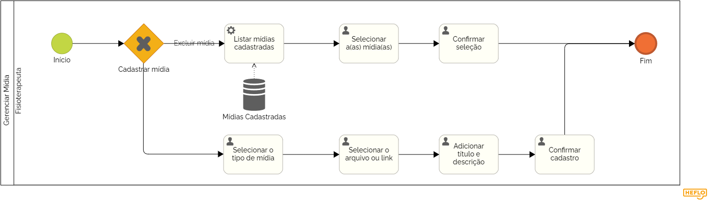

### 3.3.7 Processo 7 - Gerenciar Mídias

Este processo permite ao fisioterapeuta adicionar vídeos explicativos ou demonstrativos, imagens ilustrativas ou instrucionais para auxiliar no tratamento. Assim como deletar o que já está cadastrado. Estas mídias visam garantir que os pacientes compreendam e realizem os exercícios corretamente.

Em seguida, apresentamos o modelo do processo 7, descrito no padrão BPMN.

#### Detalhamento das atividades

---

Nessa seção serão apresentadas descrições detalhadas de cada atividade, orientando sua execução no contexto do processo.

**Atividade: Listar mídias cadastradas**

Nesta etapa, o sistema consulta o banco de dados e lista para o usuário todas as mídias previamente cadastradas (Nome, inicio da descrição, tipo de mídia e data de cadastro).

| **Comandos**    | **Destino**                                     | **Tipo** |
| --------------- | ----------------------------------------------- | -------- |
| Excluir mídias  | Selecionar a(as) mídia(as)                      | default  |
| Cadastrar mídia | Selecionar midia e preencher dados relacionados | default  |
| Vizualizar      | Mostrar dados de uma mídia                      | default  |

### Cadastro de mídia

---

**Atividade: Selecionar midia e preencher dados relacionados**

Nesta etapa, o usuário pode selecionar o tipo de mídia que deseja adicionar, um link para o conteúdo de mídia, um título e uma descrição para o conteúdo.

| **Campo**          | **Tipo**       | **Restrições**             | **Valor default** |
| ------------------ | -------------- | -------------------------- | ----------------- |
| Tipo de Mídia      | Seleção única  | Opções: Vídeo, Imagem, GIF | -                 |
| Link da Mídia      | URL            | Deve ser um link válido    | -                 |
| Título do Mídia    | Caixa de texto | Máximo de 100 caracteres   | -                 |
| Descrição do Mídia | Área de texto  | Máximo de 1000 caracteres  | -                 |

| **Comandos** | **Destino**               | **Tipo** |
| ------------ | ------------------------- | -------- |
| Salvar       | Lista de mídias           | default  |
| Cancelar     | Retorno a lista de mídias | cancel   |

---

### Excluir mídia

---

**Atividade: Selecionar a(as) mídias(as)**

Nesta etapa, o usuário pode selecionar uma ou várias mídias da lista.

| **Campo**           | **Tipo**         | **Restrições**                         | **Valor default** |
| ------------------- | ---------------- | -------------------------------------- | ----------------- |
| Mídias Selecionadas | Seleção múltipla | Selecionar uma ou mais mídias da lista | Nenhuma seleção   |

| **Comandos** | **Destino**     | **Tipo** |
| ------------ | --------------- | -------- |
| Excluir      | Lista de mídias | default  |
| Cancelar     | Lista de mídias | default  |