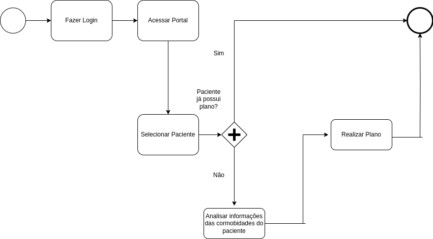

### 3.3.8 Processo 8 - Criar Plano de Tratamento

Este processo aborda a elaboração do plano de tratamento pelo fisioterapeuta. Ele engloba a adição de textos explicativos, seleção de mídias previamente cadastradas (como vídeos e imagens) e a organização do cronograma do plano. O plano de tratamento visa dar clareza e direcionamento ao paciente sobre os exercícios e etapas do tratamento.

#### Detalhamento das atividades
---

**Atividade: Adicionar Texto Explicativo**

O fisioterapeuta pode inserir textos que fornecem instruções, informações ou detalhes sobre uma etapa específica do plano de tratamento.

| **Campo**               | **Tipo**           | **Restrições**                             | **Valor default** |
| ---                     | ---                | ---                                        | ---               |
| Paciente                | Seleção Única      |                                            | -                 |
| Título do Tratamento    | Área de texto      | -                                          | -                 |
| Observações             | Área de texto      | -                                          | -                 |
| Exercícios              | Seleção Única      |                                            | -                 |
| Feedback                | Área de texto      | -                                          | -                 |
| Data de Término         | Data               | -                                          | -                 |

| **Comandos**            |  **Destino**                               | **Tipo** |
| ---                     | ---                                        | ---      |
| Salvar Tratamento       | Incorpora ao Plano de Tratamento           | default  |
| Cancelar                | Retorno aos Tratamentos                    | cancel   |

---

