## 4. Projeto da solução

### 4.1. Modelo de dados

A seguir o modelo de dados (DER) da aplicação:

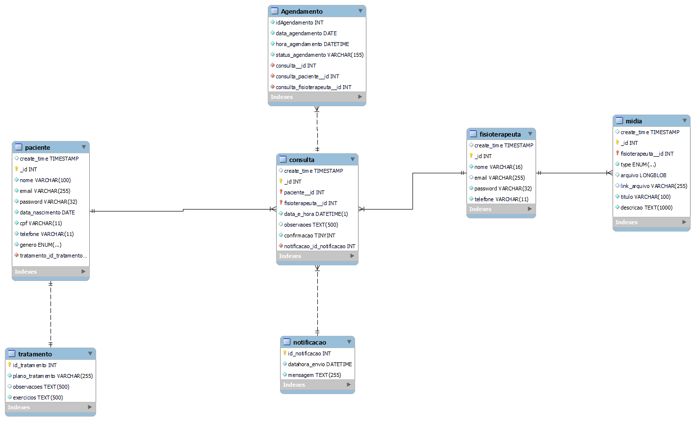

### 4.2. Diagrama de classes

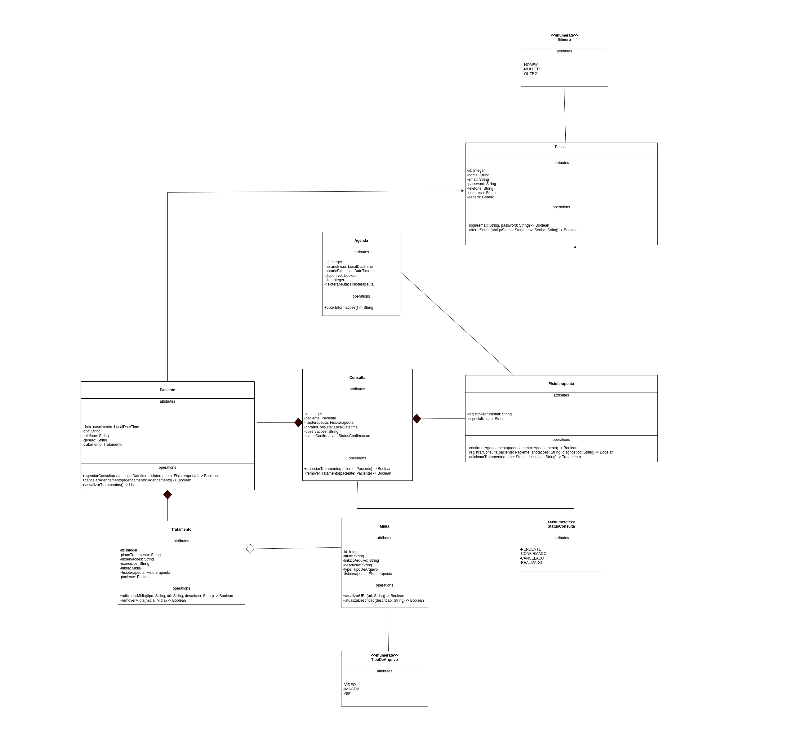

<!-- TODO - adicionar -->
__Acrescente uma breve descrição sobre o diagrama apresentado. Descreva cada uma de suas classes.__

### 4.3. Diagrama de componentes

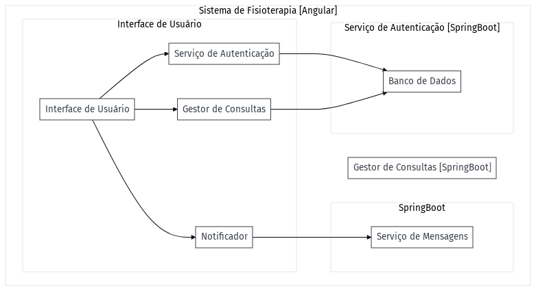

**Interface Angular:** Serve como a camada de apresentação do sistema. Utilizando Angular, fornece uma interface intuitiva para o usuário, e estabelece conexão com o servidor via APIs REST.

**Servidor Spring Boot:** É o núcleo do sistema, desenvolvido com Spring Boot. Responsável pela lógica de negócios e comunicação com a base de dados. Dentro deste, temos:

**Módulo de Autenticação:** Usando Spring Security, assegura a autenticação e autorização dos usuários.

**Módulo de Gestão de Consultas:** Administra todos os aspectos relacionados às consultas fisioterapêuticas.

**Módulo de Notificação:** Gerencia as notificações enviadas aos usuários.

**Repositório de Dados MySQL/JPA:** Utiliza o MySQL como sistema de gestão de base de dados e o JPA como interface ORM. Garante a armazenagem e recuperação eficiente dos dados do sistema.

### 4.4. Tecnologias

<!-- Comentário guia -->
<!-- _Descreva qual(is) tecnologias você vai usar para resolver o seu problema, ou seja, implementar a sua solução. Liste todas as tecnologias envolvidas, linguagens a serem utilizadas, serviços web, frameworks, bibliotecas, IDEs de desenvolvimento, e ferramentas. Apresente também uma figura explicando como as tecnologias estão relacionadas ou como uma interação do usuário com o sistema vai ser conduzida, por onde ela passa até retornar uma resposta ao usuário._ -->

A seguir, apresentamos uma descrição detalhada das tecnologias e ferramentas que serão utilizadas para resolver o problema e implementar a solução proposta:

| **Dimensão**            | **Tecnologia**                                                                               |
| ----------------------- | -------------------------------------------------------------------------------------------- |
| Versionamento           | [Git](https://git-scm.com/) + [Github](https://github.com/)                                  |
| Criação dos estilos     | [Figma](https://www.figma.com/)                                                              |
| Persistência            | [Hibernate](https://hibernate.org/)                                                          |
| Front end               | [Angular](https://angular.io/) + [Tailwind CSS](https://tailwindcss.com/)                    |
| Back end                | [SpringBoot](https://spring.io/projects/spring-boot) + [Spring Security ]()                  |
| Modelagem DB            | [MySQL Workbench](https://www.mysql.com/products/workbench)                                  |
| Modelagem BPMN          | [Heflo](https://www.heflo.com/pt-br/)                                                        |
| Teste                   | [JUnit](https://junit.org/junit5/)                                                           |
| Deploy                  | [Netlify](https://www.netlify.com/)                                                          |
| IDEs de desenvolvimenot | [VScode](https://code.visualstudio.com/) + [IntelliJ](https://www.jetbrains.com/pt-br/idea/) |

<!--| Log do sistema | [Apache Log4J](https://logging.apache.org/log4j/2.x/) | -->

Diagrama de interação das tecnologias e do usuário com o sistema

<!-- Arquivo editável: images/relacao_tecnologias.drawio -->

  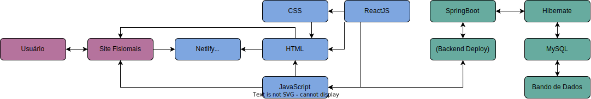

### 4.5. Guias de estilo

O Layout é caracterizando por um cabeçalho horizontal, contendo a logo e o slogan do software. Logo abaixo temos a barra de navegação e abaixo desta o conteúdo. Por fim, os detalhes e informações do software se encontram no rodapé do site

Exemplo do layout do site:

  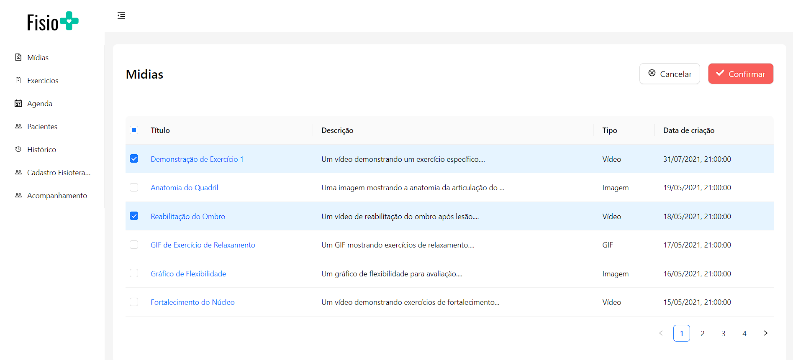
  
Exemplo de Interface de Gerenciamento de Mídias

## Design

Guia de Estilo: Cores na Área de Saúde

Escolhemos nossa paleta de cores para se adequar à área de saúde:

**Azul:** Representa confiança, essencial na área de saúde. Usamos um azul vibrante (#0A83CF) para excelência e um azul mais claro (#0BBFD9) para tranquilidade.

**Verde:** Reflete calma e bem-estar. O verde-azulado (#00C3A5) destaca harmonia, o verde claro (#0BD980) simboliza esperaça e saúde, e o verde vibrante (#0ACF42) da um contraste.

Essas cores são escolhidas para transmitir confiança, bem-estar e compromisso com a saúde na área.

## Logo

A seguir está apresentada a logo desenvolvida para o nosso sistema, a fonte escolhida e seu peso.

  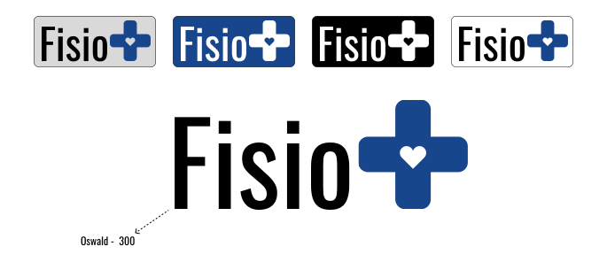

## Cores

Abaixo estão apresentadas as cores primárias do site.

  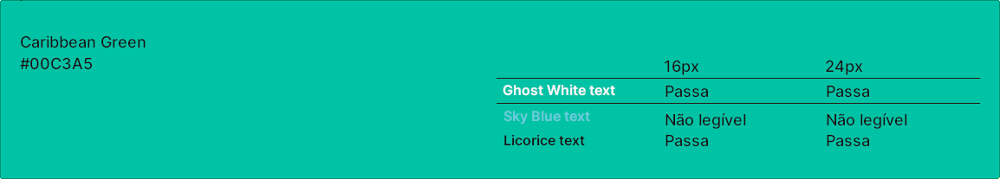
  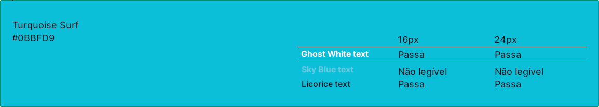
  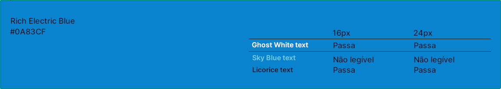
  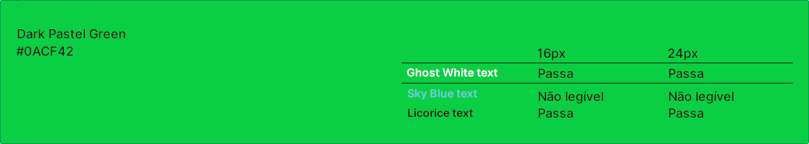
  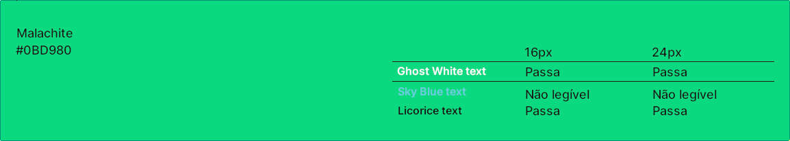

Abaixo estão apresentadas as cores de sombreamento do site.

  
  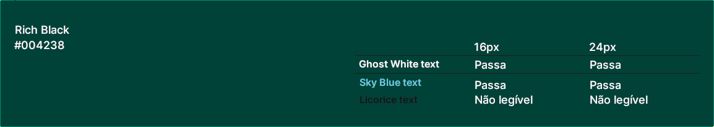
  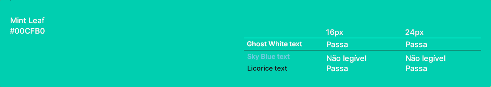
  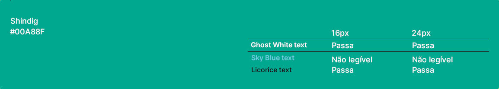

## Tipografia

A seguir estão dispostas a fonte escolhida para os textos da plataforma, seus pesos e suas funções.

<!-- __as principais funções são: Título de página, Título de seção, Rótulos de componentes e Corpo de Texto.__ -->

  

## Iconografia

<!-- TODO - adicionar -->
__Acrescente uma breve descrição sobre o diagrama apresentado. Descreva cada uma de suas classes.__

__Defina os ícones que serão utilizados e suas respectivas funções.__
__Apresente os estilos CSS criados para cada um dos elementos apresentados. Outras seções podem ser adicionadas neste documento para apresentar padrões de componentes, de menus, etc.__

> **Links Úteis**:
>
> - [Como criar um guia de estilo de design da Web](https://edrodrigues.com.br/blog/como-criar-um-guia-de-estilo-de-design-da-web/#)
> - [CSS Website Layout (W3Schools)](https://www.w3schools.com/css/css_website_layout.asp)
> - [Website Page Layouts](http://www.cellbiol.com/bioinformatics_web_development/chapter-3-your-first-web-page-learning-html-and-css/website-page-layouts/)
> - [Perfect Liquid Layout](https://matthewjamestaylor.com/perfect-liquid-layouts)
> - [How and Why Icons Improve Your Web Design](https://usabilla.com/blog/how-and-why-icons-improve-you-web-design/)
