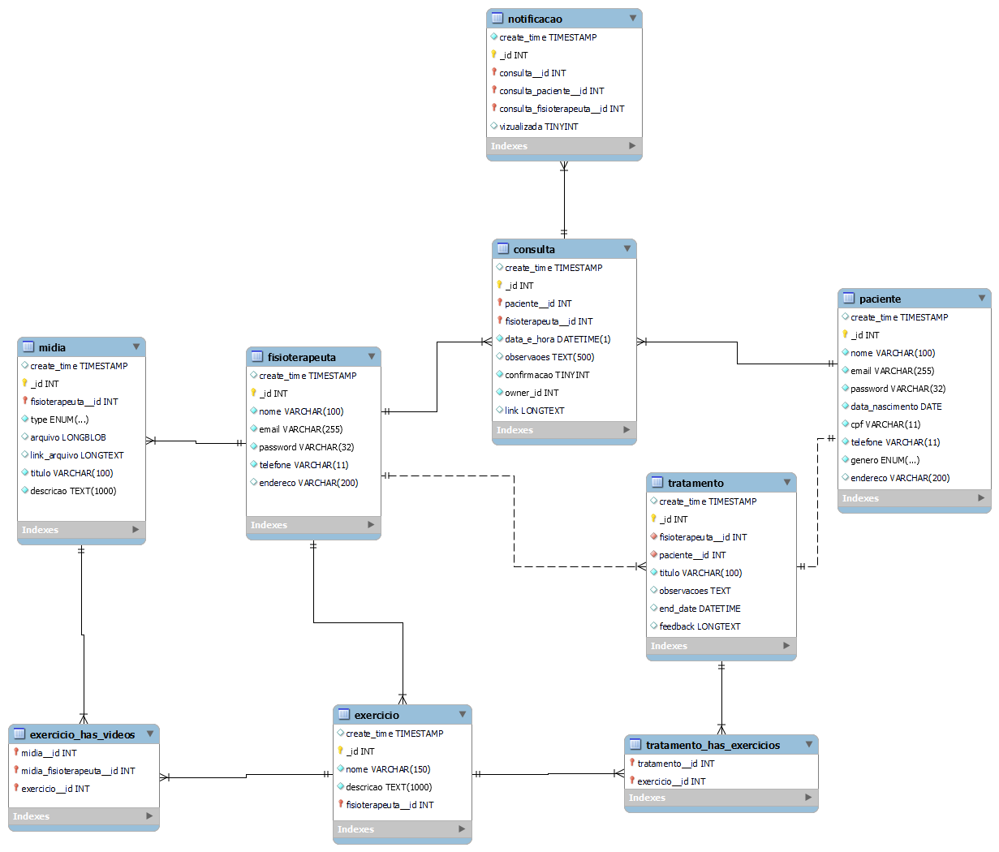
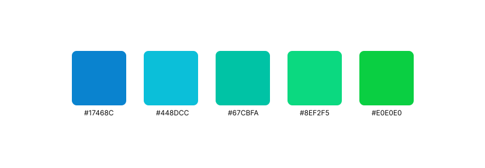

## 4. Projeto da solução

### 4.1. Modelo de dados

A seguir o modelo de dados (DER) da aplicação:

### 4.2. Diagrama de classes

_Acrescente uma breve descrição sobre o diagrama apresentado. Descreva cada uma de suas classes._

### 4.3. Diagrama de componentes

_Apresente o diagrama de componentes da aplicação, indicando os elementos da arquitetura e as interfaces entre eles. Faça uma descrição sucinta dos componentes indicando o papel de cada um deles dentro da arquitetura/estilo/padrão arquitetural. Indique também quais componentes serão reutilizados (navegadores, SGBDs, middlewares, etc), quais componentes serão adquiridos por serem proprietários e quais componentes precisam ser desenvolvidos._

_Apresente uma descrição detalhada dos artefatos que constituem o diagrama de componentes._

Exemplo: conforme diagrama apresentado, as entidades participantes da solução são:

- **Componente 1** - Lorem ipsum dolor sit amet, consectetur adipiscing elit. Cras nunc magna, accumsan eget porta a, tincidunt sed mauris. Suspendisse orci nulla, sagittis a lorem laoreet, tincidunt imperdiet ipsum. Morbi malesuada pretium suscipit.
- **Componente 2** - Praesent nec nisi hendrerit, ullamcorper tortor non, rutrum sem. In non lectus tortor. Nulla vel tincidunt eros.

### 4.4. Tecnologias

<!-- Comentário guia -->
<!-- _Descreva qual(is) tecnologias você vai usar para resolver o seu problema, ou seja, implementar a sua solução. Liste todas as tecnologias envolvidas, linguagens a serem utilizadas, serviços web, frameworks, bibliotecas, IDEs de desenvolvimento, e ferramentas. Apresente também uma figura explicando como as tecnologias estão relacionadas ou como uma interação do usuário com o sistema vai ser conduzida, por onde ela passa até retornar uma resposta ao usuário._ -->

A seguir, apresentamos uma descrição detalhada das tecnologias e ferramentas que serão utilizadas para resolver o problema e implementar a solução proposta:

| **Dimensão**            | **Tecnologia**                                                                               |
| ----------------------- | -------------------------------------------------------------------------------------------- |
| Versionamento           | [Git](https://git-scm.com/) + [Github](https://github.com/)                                  |
| Criação dos estilos     | [Figma](https://www.figma.com/)                                                              |
| Persistência            | [Hibernate](https://hibernate.org/)                                                          |
| Front end               | [React](https://react.dev/) + [Tailwind CSS](https://tailwindcss.com/)                       |
| Back end                | [SpringBoot](https://spring.io/projects/spring-boot) + [Spring Security ]()                  |
| Modelagem DB            | [MySQL Workbench](https://www.mysql.com/products/workbench)                                  |
| Modelagem BPMN          | [Heflo](https://www.heflo.com/pt-br/)                                                        |
| Teste                   | [JUnit](https://junit.org/junit5/)                                                           |
| Deploy                  | [Netlify](https://www.netlify.com/)                                                          |
| IDEs de desenvolvimenot | [VScode](https://code.visualstudio.com/) + [IntelliJ](https://www.jetbrains.com/pt-br/idea/) |

<!--| Log do sistema | [Apache Log4J](https://logging.apache.org/log4j/2.x/) | -->

Diagrama de interação das tecnologias e do usuário com o sistema

<!-- Arquivo editável: images/relacao_tecnologias.drawio -->

  

### 4.5. Guias de estilo

Layout padrão do site (HTML e CSS) que será utilizado em todas as páginas com a definição de identidade visual, aspectos de responsividade e iconografia.

Explique as guias de estilo utilizadas no seu projeto.

## Design

Detalhe os layouts que serão utilizados. Apresente onde será colocado o logo do sistema. Defina os menus padrões, entre outras coisas.

## Logo

A seguir está apresentada a logo desenvolvida para o nosso sistema, a fonte escolhida e seu peso.

  

## Cores

Abaixo estão apresentadas as cores primárias do site.

  

## Tipografia

A seguir estão dispostas a fonte escolhida para os textos da plataforma, seus pesos e suas funções.

<!-- __as principais funções são: Título de página, Título de seção, Rótulos de componentes e Corpo de Texto.__ -->

  

## Iconografia

  Defina os ícones que serão utilizados e suas respectivas funções.

  Apresente os estilos CSS criados para cada um dos elementos apresentados. Outras seções podem ser adicionadas neste documento para apresentar padrões de componentes, de menus, etc.

> **Links Úteis**:
>
> - [Como criar um guia de estilo de design da Web](https://edrodrigues.com.br/blog/como-criar-um-guia-de-estilo-de-design-da-web/#)
> - [CSS Website Layout (W3Schools)](https://www.w3schools.com/css/css_website_layout.asp)
> - [Website Page Layouts](http://www.cellbiol.com/bioinformatics_web_development/chapter-3-your-first-web-page-learning-html-and-css/website-page-layouts/)
> - [Perfect Liquid Layout](https://matthewjamestaylor.com/perfect-liquid-layouts)
> - [How and Why Icons Improve Your Web Design](https://usabilla.com/blog/how-and-why-icons-improve-you-web-design/)
